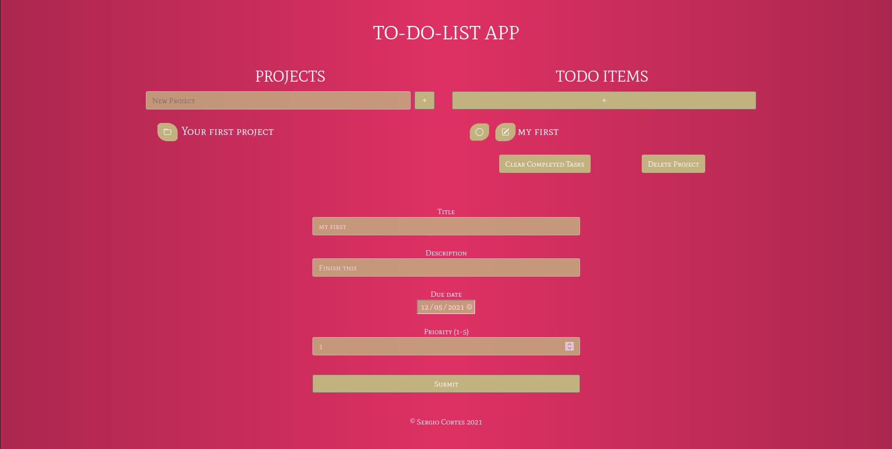

# To Do List

## Table of Contents
  <br />

* [About the Project](#about-the-project)
* [Built With](#built-with)
* [Contributing](#contributing)
* [Contact](#authors)
* [Acknowledgements](#acknowledgements) 
* [Getting Started](#getting-started) 
* [Live Demo and Video](#live-version) 

#
<br />

 <br/>
 <br/>
 <br/>


<br />

### Built With

* [JAVASCRIPT] [BOOTSTRAP] [WEBPACK] [BABEL]

## Live Version

* [Live Demo](https://sergiocortessat.github.io/JS_ToDoList/) 

<!-- ABOUT THE PROJECT   -->
## About The Project
The To-Do-List web application allows user to set different projects (Lists name) and set different to-do items for each project individually. Each project can hold as many to-do-items as the users wishes. He can edit its information, mark each to-do task as completed, clear the completed tasks and delete the main project folder.


## Screenshot Test

<p align="center">
  
</p>


## Contributing

Contributions make the open-source community such an amazing place to learn, inspire, and create. Any contributions you make are **greatly appreciated**.

## Prerequisites

Terminal or similar to execute the program.


## Getting Started


## Clone project

- To get a local copy up and running follow these simple example steps.
- Clone this repository with git clone ```https://github.com/sergiocortessat/JS_ToDoList``` using your terminal or command line.
- Change to the project directory by entering: ```cd JS_ToDoList``` in the terminal.
- Enter the project folder and run locally by using npm start.
- If the project cant be build, please run npx webpack.

## Command line steps
```
- $ git clone `$ git clone https://github.com/sergiocortessat/JS_ToDoList
- $ git checkout develop
- $ cd JS_ToDoList
- $ npm start
- ##(If project doesn't build, please run): $ npx webpack
```

## Authors

👤 Sergio Cortes Satizabal

- Github: [@sergiocortessat](https://github.com/sergiocortessat)
- Twitter: [@sergiocortessat](https://twitter.com/sergiocortessat)
- LinkedIn: [@sergiocortessat](www.linkedin.com/in/sergio-cortes-satizabal-3b452194)


<!-- ACKNOWLEDGEMENTS -->
## Acknowledgements

* [Microverse](https://www.microverse.org/)


## 📝 License

This project is [MIT](https://github.com/sergiocortessat/sergiocortessat/blob/main/LICENSE) licensed.


